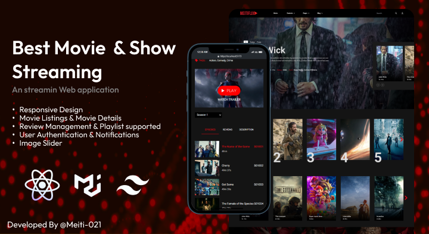

# Streaming Website

Welcome to the Streaming Website project! This is a frontend demo of a streaming website built with React, Material UI, Tailwind, and other libraries. The project showcases various features such as playlist management, a liking system, subscription plans, and a blog.

Please note that this project is a frontend demo and does not include a real backend or server-side functionality. It is meant to demonstrate the user interface and frontend implementation of a streaming website.

- To view the live demo of this website, [click here](https://meitiflix.netlify.app/).

## Features

- Playlist management: Create, edit, and delete playlists to organize your favorite videos.
- Liking system: Like and save your favorite videos for easy access.
- Subscription plan: Explore different subscription plans and enjoy exclusive content.
- Blog: Read and engage with articles and news related to streaming and entertainment.

## Technologies Used

- React: A JavaScript library for building user interfaces.
- Material UI: A UI component library that provides pre-built, customizable components following Material Design guidelines.
- Tailwind: A utility-first CSS framework for rapidly building custom user interfaces.
- Vite: A fast and opinionated web development build tool.
- SwiperJS: A modern touch slider library for smooth sliding and carousel effects.
- Video.js: An open-source web video player that supports multiple platforms and formats.
- Notistack: A notification library for React that provides an easy way to display snackbars and toasts.
- Redux Toolkit: A library that simplifies Redux state management by providing utilities for common tasks.
- Moment.js: A JavaScript library for parsing, manipulating, and formatting dates and times.
- Lottie React: A library for rendering After Effects animations natively in a React component.
- Anime.js: A lightweight animation library that allows you to create smooth animations with ease.

## Getting Started

Follow the steps below to get the project up and running on your local machine:

1. Clone the repository: `git clone [repository URL]`
2. Install dependencies: `npm install`
3. Start the development server: `npm run dev`
4. Open your browser and visit `http://localhost:5173` to access the website.

## Folder Structure

The project's folder structure is organized as follows:

## Configuration

The project uses an environment configuration file `.env` for managing environment-specific variables. Please make sure to update the necessary values before running the project.

## Deployment

To deploy the Streaming Website to a production environment, follow these steps:

1. Build the project: `npm run build`
2. Deploy the contents of the `dist/` folder to your preferred hosting platform.

## Contributing

Contributions to the Streaming Website project are welcome! If you find any issues or have suggestions for improvements, please open an issue or submit a pull request.

## License

This project is licensed under the [MIT License](LICENSE).

---

Thank you for choosing the Streaming Website project! If you have any questions or need further assistance, feel free to reach out.

Happy streaming! 🎉
